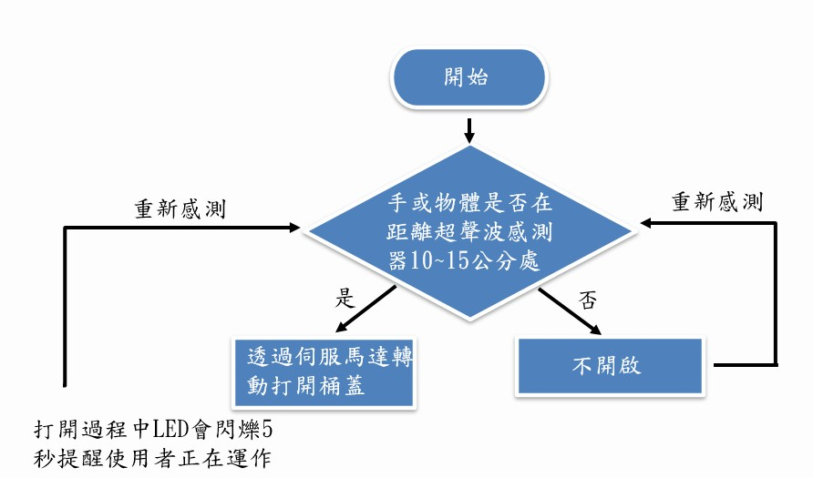
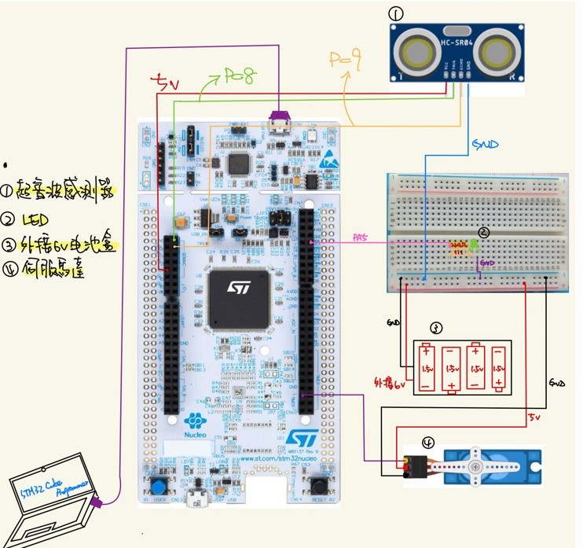

# Smarttrashcan-STM32 113-2 介面實驗專題

> 智慧垃圾桶 STM32 專案

## 專案簡介

本專案示範如何以 **STM32** 微控制器（主要以 STM32F4 系列為例）結合 **HC-SR04 超音波感測器**、**SG90 伺服馬達** 與 **LED**，實現一個「智慧垃圾桶」基本功能：  
1. 使用超音波感測器量測前方距離，當距離小於設定閾值（例如 15 cm）時觸發開蓋動作。  
2. 伺服馬達根據 PWM 信號自動打開或關閉垃圾桶蓋。  
3. LED 作為狀態指示（開蓋：LED 閃爍；關蓋：LED 長亮）。  

整個系統以 **STM32CubeMX + HAL** 驅動程式開發，並示範如何使用定時器（TIM）產生 PWM、GPIO + EXTI 處理 Echo 中斷。專案範例預設以 **STM32Fz429i** 為開發板，但您可以輕鬆地移植到其他 STM32F4/STM32F1 系列 MCU。
## 大致流程

## 電路接線示意&成品

以下圖片示意了 HC-SR04、SG90 與 NUCLEO-F401RE 之間的連接方式：  

---

## 目錄

- [硬體需求](#硬體需求)  
- [連接說明](#連接說明)  
- [軟體需求](#軟體需求)  
- [專案結構](#專案結構)  
- [建置與燒錄](#建置與燒錄)  

---

## 硬體需求

1. **MCU 開發板**  
   - 例如： STM32F429ZI (NUCLEO-F429ZI)。  
   - 板上需內建 ST-Link，以便透過 USB 直接燒錄程式。  

2. **HC-SR04 超音波感測器**  
   - Trig 腳：輸入 10 µs 短脈衝以觸發量測。  
   - Echo 腳：輸出回波脈衝，對應距離計算。  
   - Echo 訊號為 5 V，才能安全接入 STM32 的 GPIO。  

3. **SG90 伺服馬達**  
   - 使用 5 V 外部電源驅動，由 STM32 的 TIM PWM 腳輸出控制訊號。  
   - PWM 頻率約 50 Hz，佔空比範圍約 0.5 ms（0°）–2.5 ms（180°）。  

4. **LED（狀態指示燈）**  
   - 接到 GPIO 訊號線，可透過定時器或軟體迴圈實作閃爍效果（例如 1 秒亮、2 秒暗）。  

5. **電源供應**  
   - STM32 板：USB 供電 → 板內穩壓 3.3 V。  
   - HC-SR04、SG90 與 LED 外掛：可由 STM32 板上的 5 V 腳位供電，並將 GND 共地。  
   - 若伺服馬達耗流較大，建議使用獨立 5 V 電源並共地，以免 USB 供電不足。

---

## 連接說明

以下範例以 **STM32F4 Nucleo-F401RE**（或 NUCLEO-F429ZI）板為例，Arduino 風格接腳與 HAL 名稱對照如下：

| 功能             | 板上針腳 (Arduino / HAL) | 模組腳位    | 說明                                                             |
|------------------|-------------------------|-------------|------------------------------------------------------------------|
| HC-SR04 Trig     | D2 (PA 10)              | Trig        | GPIO 輸出，高電位維持 10 μs 觸發量測                                 |
| HC-SR04 Echo     | D3 (PB 3)               | Echo        | GPIO 輸入，用 EXTI / TIM Input Capture 計算 Echo 高電位持續時間    |
| SG90 PWM (0°–90°)| D6 (PA 8)               | Control     | TIM1_CH1 PWM，頻率 50 Hz，輸出 0.5 – 2.5 ms 佔空比驅動伺服          |
| LED（狀態指示）  | D13 (PA 5)              | LED         | 板載綠色 LED，可用 GPIO high/low 或用 TIM 產生閃爍                |
| 電源 3.3 V       | 3.3 V                   | VCC (STM)   | STM32 板既有電源輸出                                                    |
| 電源 5 V         | 5 V                     | VCC (外插)  | HC-SR04、SG90、LED 外掛                                           |
| 地線 (GND)       | GND                     | GND         | 需將所有模組與 MCU 共地                                           |

> **特別提醒**  
  
> led需要加上電阻  

---

## 軟體需求

- **開發環境**  
  - [STM32CubeIDE](https://www.st.com/product/STM32CubeIDE)（建議 v1.9 以上）  
  - [STM32CubeMX](https://www.st.com/en/development-tools/stm32cubemx.html)（若要自行修改 .ioc 設定）  
  - GNU Arm Embedded Toolchain（若使用命令列方式）  

- **HAL 驅動版本**  
  - STM32CubeF4 HAL 驅動程式庫 (v1.25.0 以上)  
  - CMSIS Core  

- **版本控制**  
  - Git（若要在本機以 CLI 管理，並推送至 GitHub）  

---

## 專案結構

以下範例結構示意了常見的 STM32CubeMX 專案檔案與資料夾位置，實際結構依您匯入／生成後可能略有差異：
Smarttrashcan-STM32/
├── .gitignore
├── README.md
├── LICENSE
├── Smarttrashcan-STM32.ioc # CubeMX 專案設定檔
├── Core/
│ ├── Inc/
│ │ ├── main.h
│ │ ├── stm32f4xx_it.h
│ │ └── ... # 其他自動產生 Header
│ └── Src/
│ ├── main.c
│ ├── stm32f4xx_it.c
│ ├── system_stm32f4xx.c
│ └── ... # 其他自動產生 Source
├── Drivers/
│ ├── CMSIS/
│ └── STM32F4xx_HAL_Driver/
│ ├── Inc/
│ └── Src/
└── README_IMAGES/ # 放置電路接線圖、示意圖等
├── wiring_diagram.png
└── ...

- **`.gitignore`**：建議忽略編譯生成的中間檔（如 `.o`, `.elf`, `.hex`）、IDE 設定檔等。  
- **`Smarttrashcan-STM32.ioc`**：CubeMX 設定檔，打開後可編輯時鐘、GPIO、TIM、USART、NVIC 等組態。  
- **`Core/Inc`、`Core/Src`**：CubeMX 自動產生的 HAL 初始化程式、用戶自訂的 `main.c`、中斷服務程式等。  
- **`Drivers/`**：HAL 驅動程式庫與 CMSIS Core 檔案。  
- **`README_IMAGES/`**：如果 README.md 中要顯示示意圖，可將圖片放到此資料夾並以相對路徑引用。

---

## 建置與燒錄

### A. 使用 STM32CubeIDE

1. **匯入專案**  
   - 啟動 STM32CubeIDE → `File` → `Open Projects from File System...`  
   - 選擇根目錄 `Smarttrashcan-STM32/` → 按 `Finish`  
   - IDE 自動偵測 `.ioc` 檔並詢問是否更新代碼，點選「Generate Code」。  

2. **檢查 Clock Configuration**  
   - 在 CubeMX「Clock Configuration」頁籤，確認 HSE/HSI 與 PLL 設定。  
   - 確保 APB1/ APB2 時脈不超過 MCU 規格（如 42 MHz / 84 MHz）。

3. **檢查 Pinout & Configuration**  
   - 確認以下外設對應：  
     - `TIM1_CH1` (PA_8) → SG90 PWM  
     - `EXTI3`  (PB_3) → HC-SR04 Echo  
     - `GPIO Output` (PA_10) → HC-SR04 Trig  
     - `GPIO Output` (PA_5)  → 板載 LD1 LED  
     - `USART2_TX/RX` (PA_2/PA_3) → 藍牙模組（可選）  
   - 驗證中斷 (EXTI) 與 DMA（如有用到）已正確勾選。  

4. **生成程式碼**  
   - 點擊 CubeMX 工具列上的 **Generate Code**  
   - IDE 會將所有初始化程式碼匯入 `Core/` 與 `Drivers/`。  

5. **編輯 `main.c`**  
   - 在 `Core/Src/main.c` 中，填入以下核心邏輯（範例程式碼見下方）：  
     1. 呼叫 `HAL_Init()`、`SystemClock_Config()`、`MX_GPIO_Init()`、`MX_TIM1_Init()`、`MX_USART2_UART_Init()`（如需藍牙）。  
     2. 啟動伺服 PWM：`HAL_TIM_PWM_Start(&htim1, TIM_CHANNEL_1);`  
     3. 進入 `while(1)`，不斷呼叫自訂 `Measure_Distance_CM()`，判斷是否開蓋/關蓋並更新 LED 狀態。  
     4. （可選）在開／關蓋時透過 `HAL_UART_Transmit()` 傳送狀態到藍牙模組。  

6. **編譯**  
   - 按下 IDE 上方的 **Build**（或使用快速鍵 `Ctrl+B`）。  
   - 確認底部 Console 顯示無錯誤後，生成的 `*.elf`、`*.bin`、`*.hex` 等檔案會保存在 `Debug/` 或 `Release/` 資料夾。  

7. **下載並執行**  
   - 使用 USB 線連接 Nucleo 板 → IDE 選擇 `Run > Debug` 或 `Run As > STM32 Cortex-M C/C++ Application` → IDE 自動燒錄並啟動程式。  
   - 如果要使用外部燒錄工具，可至 `Debug/` 或 `Release/` 目錄，將 `*.bin` 或 `*.hex` 檔案用 ST-Link Utility / STM32CubeProgrammer 燒錄到 MCU。

---

